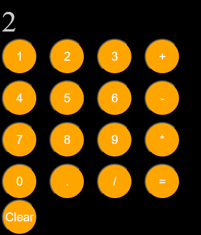

# 🔢 Retro Orange Calculator

A sleek, dark-themed web calculator featuring minimalist circular controls, built using vanilla HTML, CSS, and JavaScript.

## 🚀 Live Demo
[👉 Click here to try out the calculator live!](https://priya-bhagat01.github.io/my_calculator_project/)

## 📸 Preview

## 🛠️ Core Features & Logic
- **Mathematical Evaluation:** Built using JavaScript functions to capture button inputs, handle string expressions, and output clean calculations.
- **Dynamic Display Window:** Implemented real-time DOM updates to show typed digits and running totals instantly at the top.
- **iOS-Inspired UI Theme:** Designed a dark-mode interface featuring highly interactive, responsive circular operator buttons and a dedicated memory clear function.

## 🧰 Tech Stack
- HTML5
- CSS3
- JavaScript (ES6)
